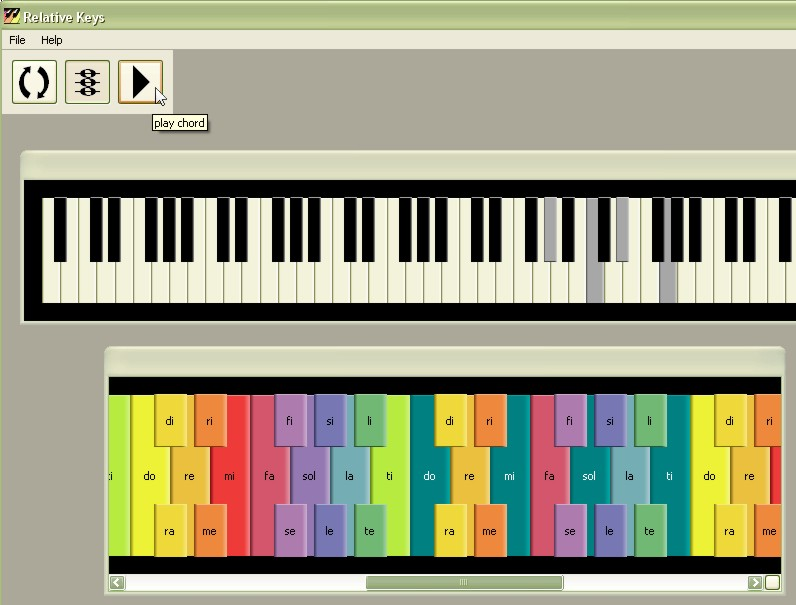

# Relative Keys 1.0

Relative Keys is a tool for transposing the solfege sequence to any of the 88 keys on a standard piano. This is useful for developing functional pitch recognition, as it allows the playing of scales, melodies, and chords in any key without reference to absolute pitches. However, these pitches can still be seen on the standard keyboard, making it a good aid for transcription.

For example, the key of A-flat major consists of the sequence A-flat, B-flat, C, D-flat, E-flat, F, G. Typically, music students who want to play only notes within the key have to remember which ones are flatted. By transposing A-flat on the piano to "do" on the solfège keyboard, they can stay within the key simply by using the major-scale sequence do, re, mi, fa, sol, la, ti. 

A Windows binary is [available](http://www.github.com/planarian/relative_keys_bin) which includes all dependencies except for the soundfont. The reason is that while the web is awash in "free" soundfonts, very few of them are demonstrably in the public domain (It's on the large side, but [this one](http://www.schristiancollins.com/generaluser.php) seems more likely than most). Provided that the file contains a piano track and is named "piano.sf2," Relative Keys should be able to use it.

## Compiling from source

This code has been compiled with [MinGW](http://www.mingw.org/), [Qt 4.7](http://www.qt.io/developers/) and [FluidSynth 1.1.5](http://www.fluidsynth.org/) (which in turn uses [GTK](http://www.gtk.org/)).

1. Install [Qt Creator](https://www.qt.io/download-open-source/#section-6)
2. Open RelativeKeys.pro
3. Attempt to build/run release version. This will fail, but create a directory called RelativeKeys-build[...]Release.
4. Within this directory, add your piano.sf2.
5. Into the release subdirectory, copy the following files: libfluidsynth.dll, libfluidsynth.dll.a, mingwm10.dll, intl.dll, libgcc-s-dw2-1.dll, libglib-2.0-0.dll, libgthread-2.0-0.dll, mingwm10.dll.
6. The next build/run should succeed.
7. In order to run independently of Qt Creator, the new executable must be combined with the files listed in 4 & 5, and the main Qt libraries QtCore4.dll and QtGui4.dll (or possibly more recent versions) which are bundled with Creator.

## License

Relative Keys is subject to the [MIT license](http://opensource.org/licenses/MIT). Qt, Fluidsynth, and GTK are under [LGPL](https://www.gnu.org/copyleft/lesser.html), and MinGW is under [GPL](https://gnu.org/licenses/gpl.html).

## Contact

If you have any questions you can find me at http://www.jay-davis.net

